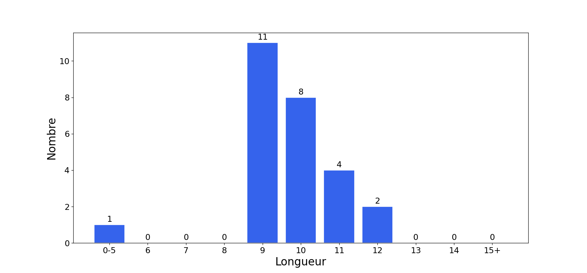

# Graphcat-ng

Generate graphs and charts from Hashcat potfiles and NTDS dumps.

* HTML report with password cracking statistics
* Automatic PNG charts stored alongside the report
* English and French support

## Table of Contents

- [Installation](#installation-)
- [Helper](#helper)
- [Usage](#usage)
- [Formats](#formats)
- [Charts Example](#charts-example)

## Installation

### Prerequisite
```text
apt install python3-venv
```

### Steps
```text
git clone https://github.com/WodenSec/graphcat-ng
cd graphcat-ng
python3 -m venv .venv
source .venv/bin/activate
pip install .
```

## Helper

```text
$ graphcat.py -h
usage: graphcat.py [-h] -p hashcat.potfile -H hashfile.txt [-f FORMAT] [-o OUTPUT_DIR] [-d]

Password Cracking Graph Reporting

options:
  -h, --help            show this help message and exit
  -p hashcat.potfile, --potfile hashcat.potfile
                        Hashcat potfile
  -H hashfile.txt, --hashfile hashfile.txt
                        File containing hashes (one per line)
  -f FORMAT, --format FORMAT
                        hashfile format (default 3): 1 for hash; 2 for username:hash; 3 for secretsdump (username:uid:lm:ntlm)
  --french              Generate report in French
  -o OUTPUT_DIR, --output-dir OUTPUT_DIR
                        Output directory
  -d, --debug           Turn DEBUG output ON
```

## Usage

Provide a potfile with `-p/--potfile` and a hash list with `-H/--hashfile`. The hashes must follow one of the [three supported formats](#formats) (default: **Secretsdump**).

Graphcat will build a full report with password cracking charts and automatically save the graphs as PNG files.

```text
$ graphcat.py -H entreprise.local.ntds -p hashcat.pot
[-] Parsing potfile
[-] 95 entries in potfile
[-] Parsing hashfile
[-] 923 entries in hashfile
[-] Generating graphs...
Results directory: ./results_2025-06-14_17-35-49
[-] Generating report...
```

### Formats

1: Only Hash

```text
31d6cfe0d16ae931b73c59d7e0c089c0
31d6cfe0d16ae931b73c59d7e0c089c0
31d6cfe0d16ae931b73c59d7e0c089c0
```

2: Username + Hash

```text
test1:31d6cfe0d16ae931b73c59d7e0c089c0
test2:31d6cfe0d16ae931b73c59d7e0c089c0
test3:31d6cfe0d16ae931b73c59d7e0c089c0
```

3: Secretsdump

```text
waza.local\test1:4268:aad3b435b51404eeaad3b435b51404ee:31d6cfe0d16ae931b73c59d7e0c089c0:::
waza.local\test2:4269:aad3b435b51404eeaad3b435b51404ee:31d6cfe0d16ae931b73c59d7e0c089c0:::
waza.local\test3:4270:aad3b435b51404eeaad3b435b51404ee:31d6cfe0d16ae931b73c59d7e0c089c0:::
```

If a hash occurs more than once in the hash file, it will be counted that many times.

Moreover, if you submit secretsdump with password history (`-history` in secretsdump command), it will analyze similarity in password history

## Charts Example


**Graphcat-ng now supports French** for the report (including graphs !). Add the `--french` flag to your command.




